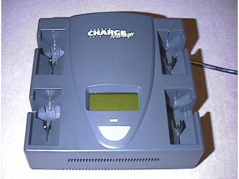
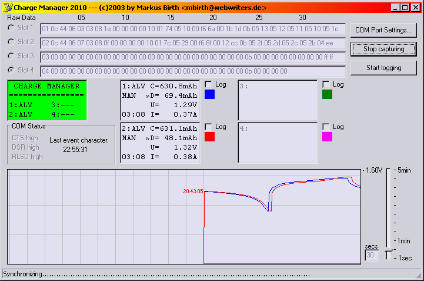
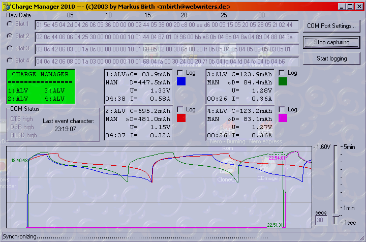

Conrad Charge Manager 2010
==========================

:warning: **Projekt eingestellt.** :warning:

Da ich schon eine halbe Ewigkeit keine Zeit mehr gefunden habe, am CM2010Project weiterzuarbeiten, stelle ich hiermit offiziell das Projekt ein. Wer auf eigene Faust daran weiterentwickeln möchte, kann sich bei mir melden und kann dann hier bei SourceForge als Entwickler eingetragen werden.

Schon vor etwa 1 Jahr hab ich [LogView](http://www.logview.info/) entdeckt und damals war schon absehbar, dass es nur noch eine Frage der Zeit sein würde, bis die beiden Entwickler Unterstützung für den CM2010 einbauen. Dies ist nun geschehen und die neueste Version 1.14.2 unterstützt den Charge Manager 2010.

Das ist mein CM2010. Das beste an ihm ist die RS232-Schnittstelle an der Rückseite. Leider rückt der Hersteller nicht mit Informationen über das verwendete Datenformat raus. Aber anhand der Beschreibung von [Christoph Heine](http://www.stud.uni-karlsruhe.de/~ux89/) war ich in der Lage, ein kleines Programm zu schreiben und bin während des Programmierens sogar auf neue Informationen gestossen.

Ersten Kontakt herstellen
-------------------------

Für das Auslesen des CM2010 braucht man einen freien seriellen COM-Port und ein Nullmodemkabel. Die Übertragungsparameter sind in der Tabelle unten zu sehen.

Es werden kontinuierlich Informationen gesendet. Man erhält 4 Mal pro Sekunde Informationen über einen einzelnen Schacht, d.h. in 1 Sekunde hat man die Daten über alle 4 Schächte zusammen.

|Parameter       |Wert     |
|---------------:|:------- |
|Geschwindigkeit:|9600 baud|
|Datenbits:      |8        |
|Parität:        |keine    |
|Stoppbits:      |1        |
|Flusskontrolle: |DTR      |

Das Datenformat
---------------

Jeder Datensatz über einen einzelnen Slot besteht aus 34 Bytes.
Hier kommt eine Aufschlüsselung über die gesendeten Informationen. Numerische Werte sind im Big Endian Format codiert, d.h. das höchstwertige Byte steht links. Also 256d wäre dann 01 00h und 65538d 01 00 02h.

Mit "xx/Hi" meine ich die vier ersten(linken) Bits des Bytes, mit "xx/Lo" dann natürlich die 4 letzten(rechten) Bits des Bytes.

|Byte(s)|Beschreibung|
|:------|:-----------|
|01     |Nummer des Slots, über den die Daten sind|
|02/Hi  |???|
|02/Lo  |Gibt Auskunft über die momentane Display-Anzeige. (siehe unten)|
|03/Hi  |Gibt Auskunft über die gewählte Akku-Kapazität im manuellen Modus. (siehe unten)|
|03/Lo  |Gibt Auskunft über den Ablauf des Programms. (siehe unten)|
|04     |??? (Könnte was mit der Füllstandsmessung zu tun haben. Bei `00`h (ganz kurz) aktualisiert er die symbolische Batterie im Display. Sonst unterschiedliche Werte.)|
|05     |Interner Zähler. Zählt nach Einlegen des Akkus die 3 Sekunden, die man Zeit hat, eine Option zu wählen, rückwärts. Ansonsten zählt er von 60d rückwärts und bei 00 erfolgt Umsprung auf die nächste Minute.|
|06     |Stunden, die der Akku bearbeitet wurde.|
|07     |Minuten, die der Akku bearbeitet wurde.|
|08     |???|
|09-10  |Spannung (U; in mV) - nur beim Aufladen, sonst `00 00`. Evtl. max. Spannung für Delta-U-Abschaltung.|
|11     |??? (evtl. ungefährer Füllstand des Akkus?)|
|12     |???|
|13     |???|
|14-15  |Stromstärke (I; in mA) mit der geladen/entladen wird.|
|16-17  |Spannung (U; in mV) des Akkus.|
|18-20  |Geladene Kapazität. (CCap; in 10-2 mAh)|
|21-23  |Entladene Kapazität. (DCap; in 10-2 mAh)|
|24     |??? (`0B`h, wenn nicht geladen wird. Sonst auch mal was anderes.)|
|25-26  |Vor-vor-vor-letzte Spannung|
|27-28  |Vor-vor-letzte Spannung|
|29-30  |Vor-letzte Spannung|
|31-32  |Letzte Spannung|
|33-34  |Widerstand im Schacht. (kein Akku: `FF FF`; 5 MOhm: `01 F4`)|

### 02/Lo

|Hex|Bin |Anzeige                     |
|--:|:--:|:---------------------------|
| 0 |0000|`----` (kein Akku eingelegt)|
| 1 |0001|`SELECT AUTO/MAN: AUTO`     |
| 2 |0010|`SELECT AUTO/MAN: MANUAL`   |
| 3 |0011|`SELECT PROGRAM: CHARGE`    |
| 4 |0100|`SELECT PROGRAM: DISCHARGE` |
| 5 |0101|`SELECT PROGRAM: CHECK`     |
| 6 |0110|`SELECT PROGRAM: CYCLE`     |
| 7 |0111|`SELECT PROGRAM: ALIVE`     |
| 8 |1000|`CHA`                       |
| 9 |1001|`DIS`                       |
| a |1010|`CHK`                       |
| b |1011|`CYC`                       |
| c |1100|`ALV`                       |
| d |1101|`RDY`                       |
| e |1110|`ERR`                       |
| f |1111|`TRI`                       |

Hinweis: Bei 2h springt das Display nach 3 Sekunden zur Kapazitätswahl. Natürlich sieht man dann im Display nicht mehr "SELECT AUTO/MAN: MANUAL", sondern die Auswahl für die Kapazität. Dies sieht man dann aber am dritten Byte.

### 03/Hi

|Hex|Bin |Akku-Kapazität  |
|--:|:--:|:---------------|
| 0 |0000|Automatische Erkennung (`SELECT AUTO/MAN: AUTO`)|
| 1 |0001|100-200 mAh     |
| 2 |0010|200-350 mAh     |
| 3 |0011|350-600 mAh     |
| 4 |0100|600-900 mAh     |
| 5 |0101|900-1200 mAh    |
| 6 |0110|1200-1500 mAh   |
| 7 |0111|1500-2200 mAh   |
| 8 |1000|2200-... mAh    |

**Hinweis:** Wenn dieses Teilbyte NICHT `00`h ist, befindet sich der Ladeschacht im "MAN"-Modus, ansonsten dann "AUTO".

### 03/Lo

|Hex|Bin |Programmschritt                           |
|--:|:--:|:-----------------------------------------|
| 0 |0000|kein Programm aktiv / Kein Akku eingelegt |
| 1 |0001|Laden ← `ALV` startet hier                |
| 2 |0010|Entladen                                  |
| 3 |0011|Laden ← `CYC` startet hier                |
| 4 |0100|Entladen ← `CHK` startet hier             |
| 5 |0101|Laden ← `CHA` startet hier                |
| 6 |0110|Entladen (wird übersprungen, nur bei `DIS` startet das Programm hier)|
| 7 |0111|Erhaltungsladung (Trickle)                |
| 8 |1000|`RDY` Fertig!                             |

* Bei `ALV` läuft der CM2010 folgende Schritte ab: 1, 2, 3, 4, 5, 8.
* Bei `CYC`: 3, 4, 5, 8.
* Bei `CHK`: 4, 5, 8.
* Bei `CHA`: 5, 8.
* Bei `DIS`: 6, 8. Wenn nach dem Laden die Akkuspannung sinkt, kommt `TRI`.

Synchronisieren
---------------

Wenn man diese Informationen auslesen will, ist es wichtig, dass man das Programm mit dem Datenstrom synchronisiert - damit man nicht irgendwelches Kauderwelsch angezeigt bekommt.

Wie man am Protokoll sehen kann, ist das erste Byte IMMER die Nr. des Ladeschachts. Also kann man darauf prima synchen - alle 35 Bytes muss der Wert um 01h größer werden und nach 04h muss 34 Bytes später 01h kommen.

Screenshots
-----------

Mein Programm in Aktion:

Oben sieht man die 4 Zeilen mit den Rohdaten für den jeweiligen Slot. Der gewählte Radiobutton zeigt immer an, für welchen Slot gerade die Daten erwartet werden.

Das grüne ist die Übersichtsanzeige, wie man sie auch auf dem CM2010 sieht - allerdings ohne die Füllstandsymbole. In der Mitte sind die 4 Anzeigen mit den Details über jeden Schacht und daneben die jeweiligen Einstellungen für Graph-Farbe und Logging-AN/AUS. (Die Schächte 3 und 4 sind leer.)

Links davon unter der Übersichtsanzeige ist der Status des COM-Ports zu sehen, sowie die Zeit, wann das letzte Zeichen vom COM-Port gelesen wurde.

Oben rechts ist der Knopf, um die COM-Port-Optionen einzustellen. Normalerweise muss nur der richtige Port eingestellt werden - der Rest sollte stimmen.

Darunter ist der Start/Stop-Knopf. Und wiederum darunter ist der Knopf, der mal das Mitloggen des Ladeverlaufs bewirken soll.

Unten ist das Graph-Feld, welches die Spannungsverläufe in den einzelnen Schächten grafisch darstellt. Schwankungen von mehr als ±0,5V werden zusätzlich mit der Zeit kommentiert.

Rechts davon ist der Regler für die Aktualisierungsrate.

Hier nochmal ein Screenshot mit aktiviertem Alpha-Blending. Normalerweise ist diese Option ausgeschaltet. Man kann sie aber durch ein paar Einträge in die CM2010Project.ini aktivieren (Siehe [Changelog](CHANGES.md).)

Links
-----

* [LogView](http://www.logview.info/)
* [Christoph Heine's CM2010-WebInterface für Perl](http://www.stud.uni-karlsruhe.de/~ux89/cm.html)
* [Jens Friedrich's CM2020-WebInterface für Perl](http://www.ibrf.de/CM2020/CM2020.html)
* [CM2010 bei CONRAD Electronic](http://www.conradelektronik-direkt.de/coel/38/charge_manager_2010_x_x.htm)
